<div align="center">
  
# 🧠 AI Market Intelligence — Multi-Agent Decision Framework  
### A Global Multi-Agent Financial Analysis & Decision Support System

<p align="center">
    <!-- LangChain -->
  
    <!-- LLM -->
  
  <!-- AI Agents -->
  
  <!-- Yahoo Finance -->
  
  <!-- Python Version -->
  
  <!-- Streamlit -->
  
  <!-- Gemini / Google AI -->
  

</p>

## [Visit the Website](https://aifinanceagentllm.streamlit.app/)


</div>


**AI Market Intelligence** is an advanced, multi-agent financial analytics platform powered by **Google Gemini 2.0**.  
It enables **researchers**, **traders**, **asset managers**, and **risk professionals** to:

- Generate **benchmark-aware investment insights**
- Analyze **global equities**
- Compute **quantitative risk metrics**
- Explore markets using **interactive AI explanations**

The platform integrates **real market data**, **multi-agent reasoning**, **quantitative finance**, and **interactive visual analytics** into a single **institutional-grade workflow**.

---

## 📌 Table of Contents

- [Overview](#-overview)
- [Screenshots](#-screenshots)
- [Key Features](#key-features)
- [Multi-Agent Architecture](#multi-agent-architecture)
- [System Capabilities](#system-capabilities)
- [Quantitative Analytics](#quantitative-analytics)
- [Tab-by-Tab Breakdown](#tab-by-tab-breakdown)
- [Data Sources](#data-sources)
- [Installation & Setup](#installation--setup)
- [Tech Stack](#tech-stack)
- [Target Users](#target-users)
- [Future Enhancements](#future-enhancements)

---

## Overview

**AI Market Intelligence** is a **decision-support platform** combining:

- 🧩 Multi-agent AI reasoning  
- 📊 Benchmark-aware financial analysis  
- 📈 Quantitative market analytics  
- 💬 Real-time sentiment extraction  
- 🌎 Global market data  
- 💼 Portfolio optimization  
- 🤝 Interactive AI insights  

It is designed to help professionals make **faster, smarter, and data-driven decisions** in financial markets.

---

## Screenshots

### 📈 Overview
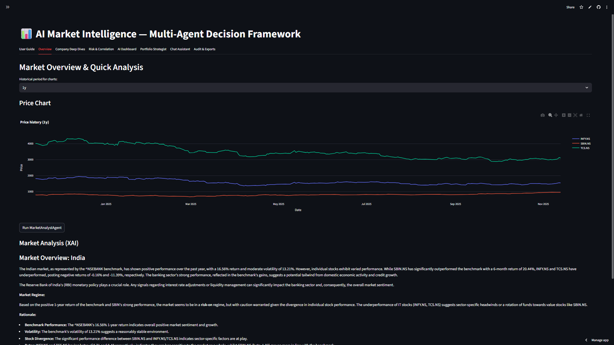

---

### 🧭 User Guide
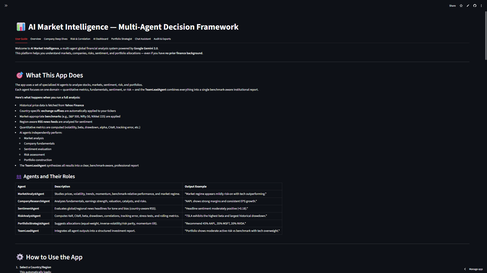

---

### 🏢 Company Deep Dives
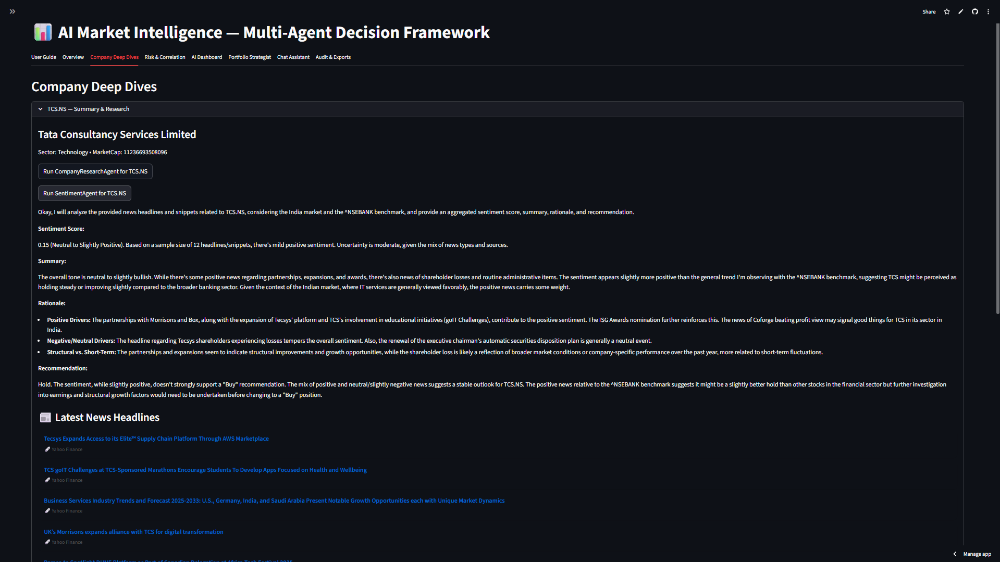

---

### 📉 Risk & Correlation (Masonry Collage)

<p align="center">
  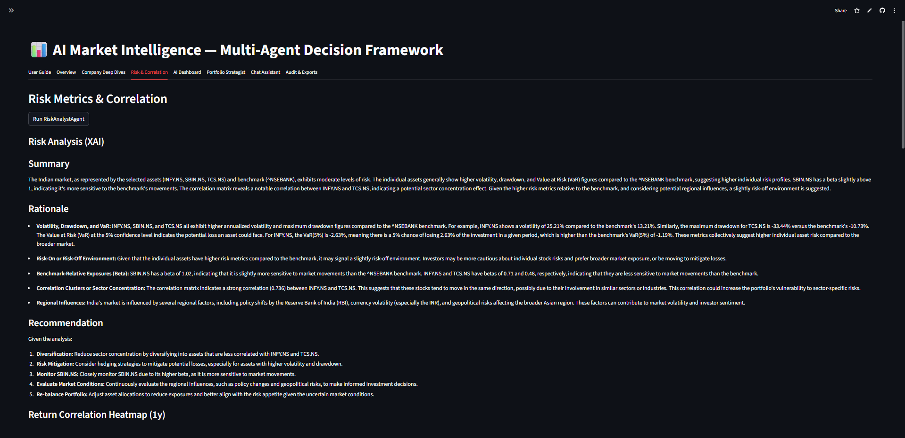
  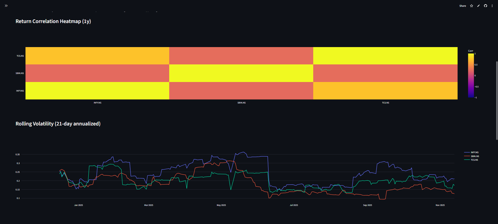
  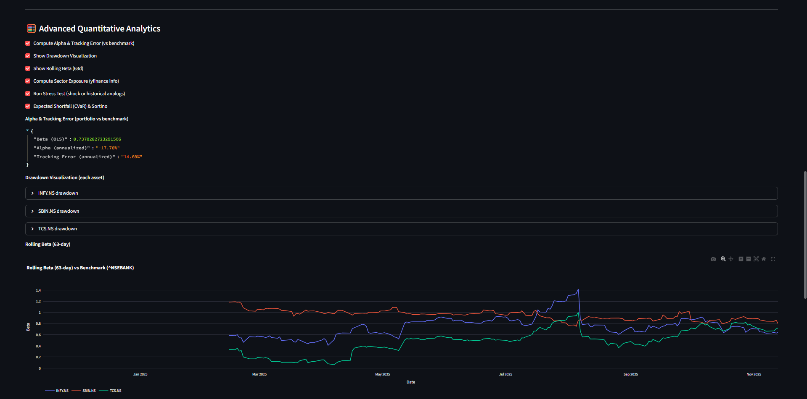
</p>
<p align="center">
  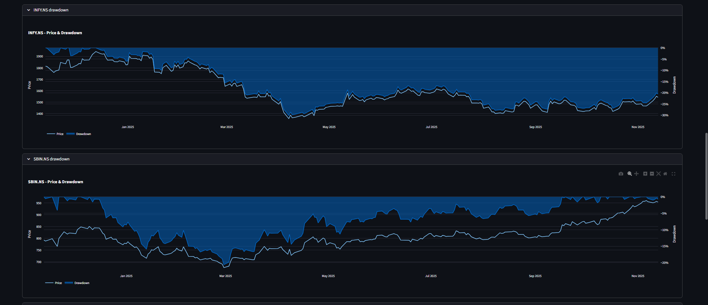
  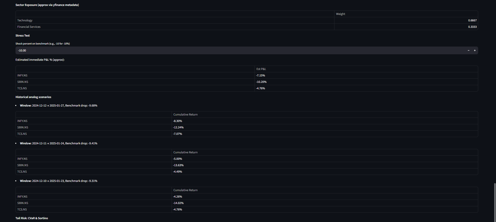
</p>

---

### 🤖 AI Dashboard
<p align="center">
  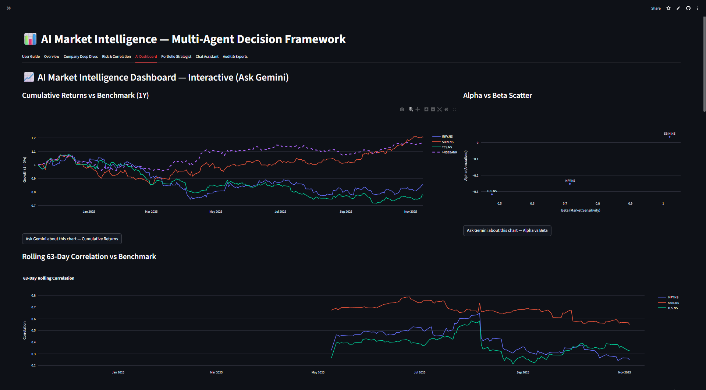
  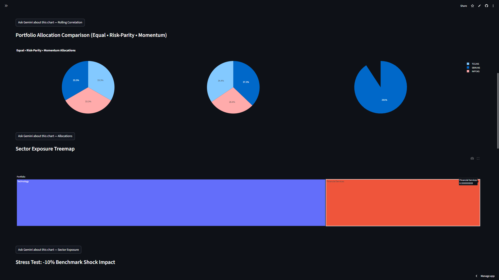
</p>
<p align="center">
  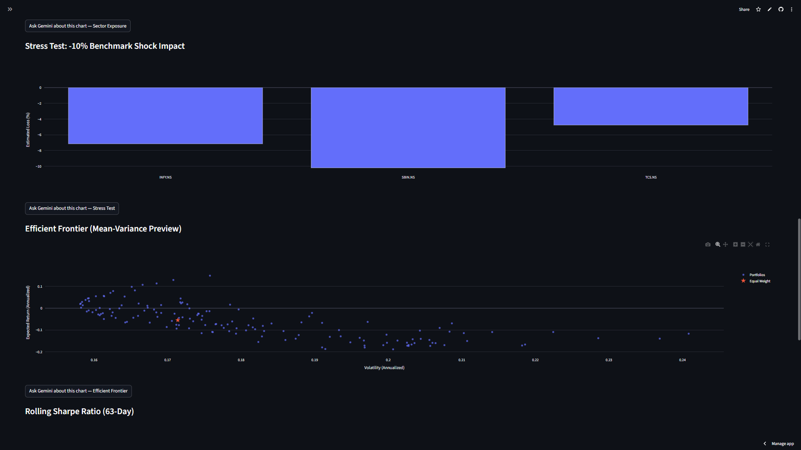
  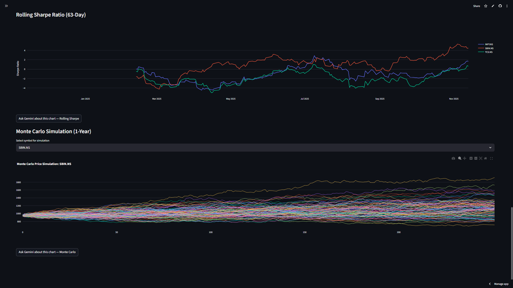
</p>

---

### 📊 Portfolio Strategist  
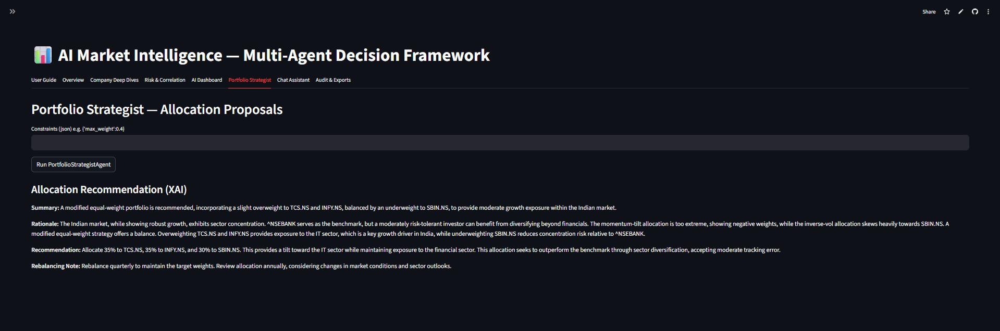


---

### 💬 Chat Assistant
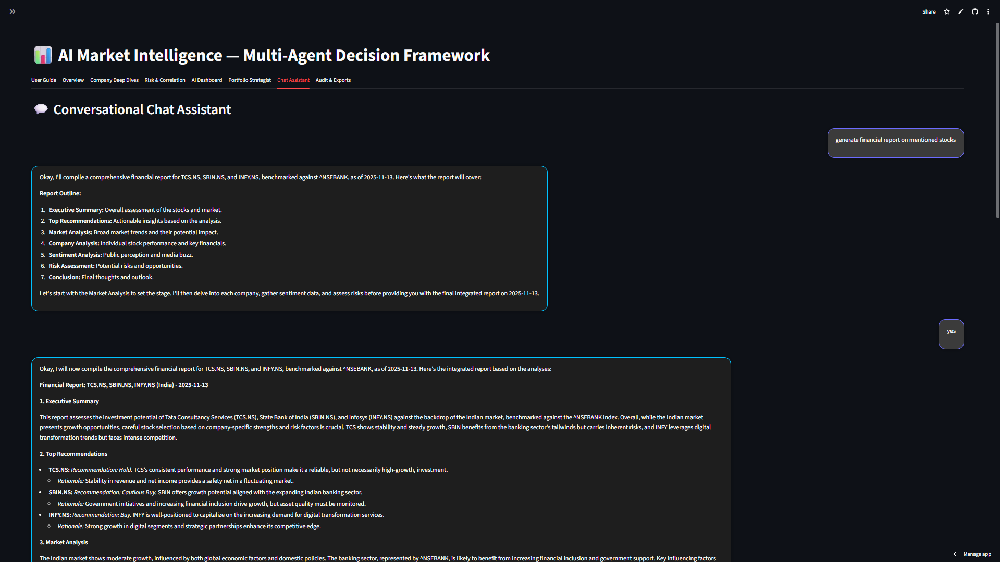
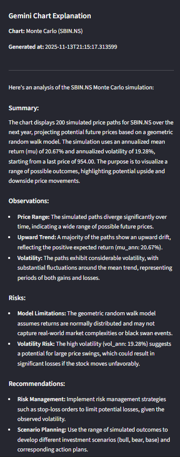

---

### 📘 Audit & Exports  
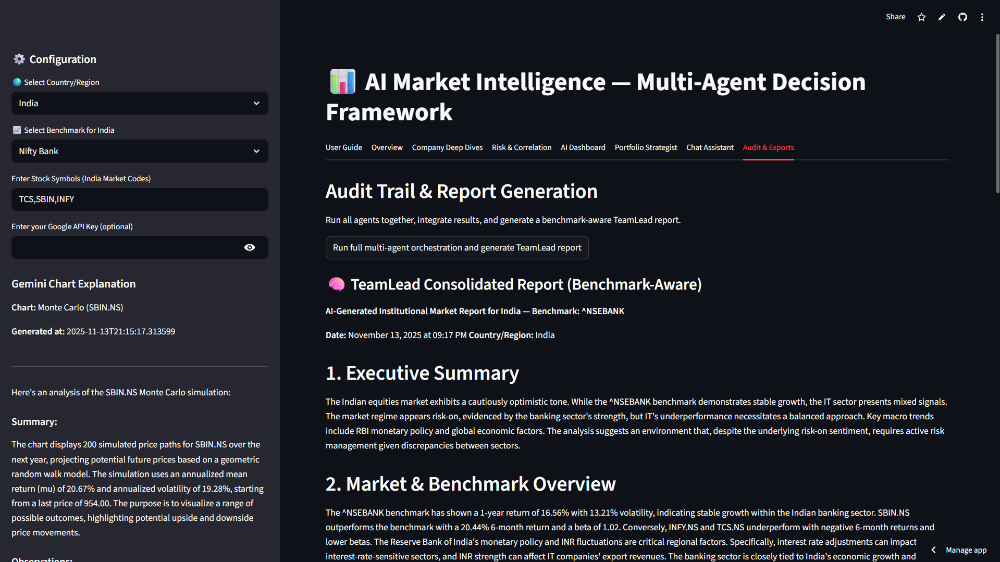

---

## Key Features

### 🔸 1. Multi-Agent Market Intelligence

Six highly specialized AI agents independently analyze different domains:

| **Agent** | **Role** |
|------------|-----------|
| 🧠 **MarketAnalystAgent** | Market trends, volatility, momentum & regime detection |
| 🏢 **CompanyResearchAgent** | Fundamentals, earnings, catalysts, valuation |
| 💬 **SentimentAgent** | Region-aware news sentiment from live RSS feeds |
| ⚖️ **RiskAnalystAgent** | VaR, CVaR, beta, drawdown, correlations, stress tests |
| 📊 **PortfolioStrategistAgent** | Allocation strategies: equal weight / risk parity / momentum |
| 👨‍💼 **TeamLeadAgent** | Synthesizes all insights into a final benchmark-aware report |


### 🔸 2. Global Market Support

- 🌎 Multi-country ticker normalization  
- 📈 Regional benchmark selection  
- 🏛️ Exchange suffix auto-application  
- 📰 Region-aware news in multiple languages  


### 🔸 3. Quantitative Analytics Engine

Includes institutional-grade risk & performance analytics:

- Rolling Volatility  
- Rolling Beta (vs benchmark)  
- Correlation Heatmap  
- Maximum Drawdown  
- Alpha & Tracking Error  
- Value-at-Risk (VaR)  
- Conditional VaR (CVaR / Expected Shortfall)  
- Sortino Ratio  
- Sector Composition Approximation  

**Stress Testing:**
- ⚡ Shock-based stress test  
- 📉 Historical analog crash scenarios  


### 🔸 4. Benchmark-Aware Reporting

All insights, charts, and metrics are contextualized against benchmark indices, such as:

> **S&P 500**, **NASDAQ 100**, **Dow Jones**, **FTSE 100**, **Nikkei 225**, **Nifty 50**, **Euro Stoxx 50**


### 🔸 5. Interactive AI Dashboard

Users can ask **Gemini**:

> _"Explain this chart to me"_

And receive:
- Observations  
- Risk insights  
- Anomalies  
- Trend interpretation  
- Recommendations  


### 🔸 6. Portfolio Strategy Engine

Supports multiple allocation frameworks:

- Equal-Weight  
- Risk-Parity (inverse volatility)  
- Momentum Tilt  
- Custom Inputs  

Includes **expected risk/return interpretation** for each strategy.


### 🔸 7. Chat Assistant

A conversational interface to ask about:

- Market questions  
- Company comparisons  
- Risk explanations  
- Benchmark analysis  
- Financial definitions  
- Portfolio construction

---

## Multi-Agent Architecture
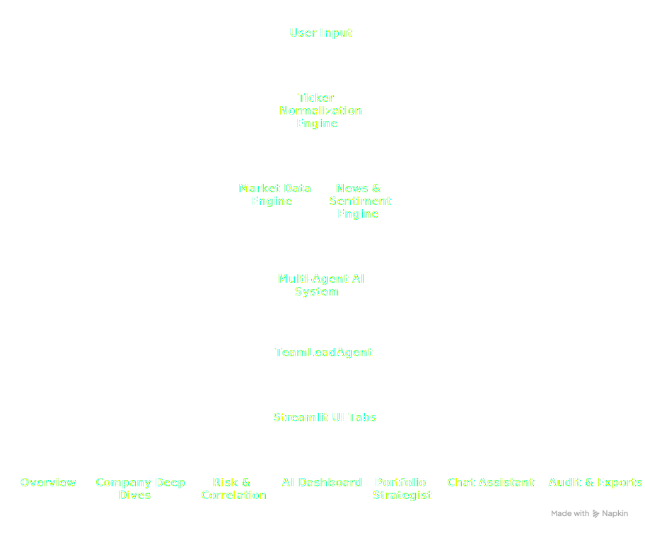

### Multi-Agent Workflow
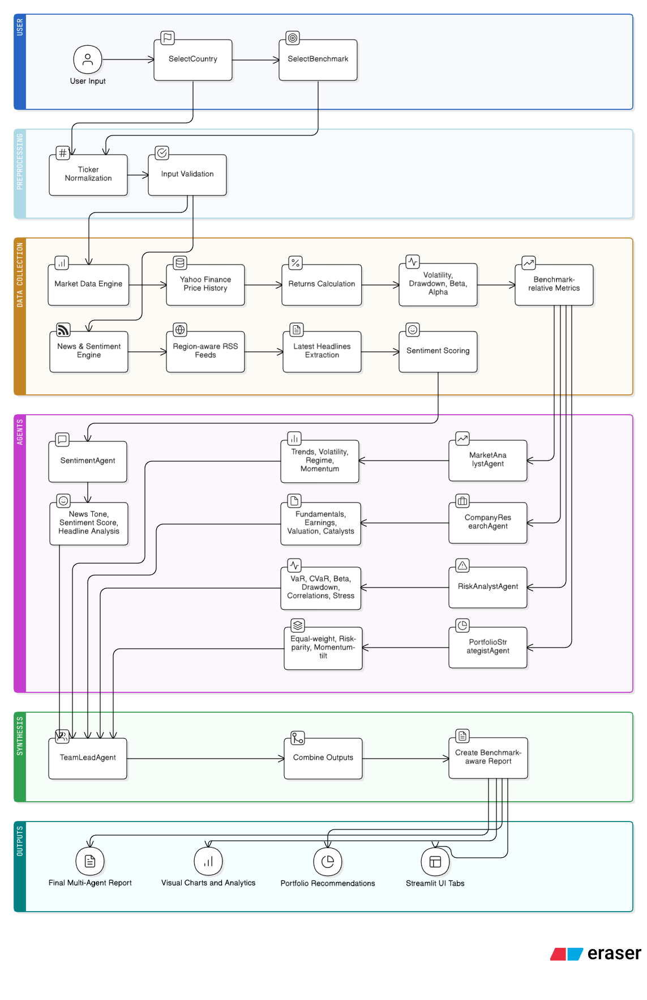

The system follows a **multi-agent orchestration pipeline** where each specialized AI agent contributes domain-specific intelligence to the final report.

Each Agent Receives
- 🧹 **Cleaned and pre-processed data**  
- 📈 **Historical price series**  
- 📊 **Computed returns and volatility metrics**  
- 🌍 **Regional sentiment information**  
- 🧮 **Benchmark-adjusted metrics**  

The **TeamLeadAgent** consolidates all agent outputs, applies **benchmark awareness**, and generates a **final institutional-grade report** that includes:

- 🧠 **Synthesized insights**  
- 📉 **Quantitative performance metrics**  
- ⚖️ **Risk evaluation**  
- 💼 **Portfolio recommendations**  
- 💬 **Interactive explanations via Gemini**  

---

## System Capabilities

- ✔ **Global equity analysis**  
- ✔ **Benchmark-relative performance**  
- ✔ **Rolling factor analytics**  
- ✔ **Quantitative risk modeling**  
- ✔ **AI-assisted chart interpretation**  
- ✔ **Portfolio design & optimization**  
- ✔ **News sentiment classification**  
- ✔ **Multi-agent chain-of-thought synthesis**  
- ✔ **Rich visualization suite** (powered by *Matplotlib* & *Seaborn*)  

---

## Quantitative Analytics

| **Metric** | **Description** |
|-------------|-----------------|
| **VaR (Value-at-Risk)** | Worst expected loss at a given confidence level |
| **CVaR (Expected Shortfall)** | Average loss in tail-risk events |
| **Rolling Beta** | Benchmark sensitivity over time |
| **Alpha** | Outperformance vs benchmark |
| **Tracking Error** | Deviation from benchmark |
| **Correlation Matrix** | Inter-asset co-movements |
| **Drawdown Curve** | Historical peak-to-trough dynamics |
| **Stress Test** | Shock simulation & historical crash modeling |
| **Sector Exposure Approximation** | Equal-weighted sector inference |

---

## Tab-by-Tab Breakdown

### User Guide  
Beginner-friendly introduction & glossary.

### Overview  
- 📈 Price charts  
- 📊 Cumulative returns  
- 🧠 *MarketAnalystAgent* insights  

### Company Deep Dives  
- 🏢 Company metadata  
- 💰 Financials  
- 📰 News sentiment  
- 🧾 *CompanyResearchAgent* results  

### Risk & Correlation  
- 📉 Volatility  
- 🔥 Correlation heatmaps  
- ⚖️ Rolling beta  
- 🧮 CVaR & VaR  
- 💥 Stress tests  
- 👁️ *RiskAnalystAgent* insights  

### AI Dashboard  
- 💬 Interactive Gemini explanations  
- 📊 Multi-chart insights  

### Portfolio Strategist  
- ⚖️ Equal-weight  
- 📈 Risk parity  
- 🚀 Momentum tilt  
- 🤖 *PortfolioStrategistAgent* recommendations  

### Chat Assistant  
- 🗣️ Context-aware question routing  
- 🤝 Multi-agent responses  

### Audit & Exports  
- 🧾 *TeamLeadAgent* multi-agent report  
- 📘 Benchmark-aware synthesis  

---

## Data Sources

| **Source** | **Usage** |
|-------------|-----------|
| **Yahoo Finance** | Prices, metadata, and returns |
| **RSS News Feeds** | Region-aware news sentiment |
| **Google Gemini 2.0** | AI reasoning, synthesis, and explanations |

---

## Installation & Setup

Clone the repository and install the required dependencies:

```bash
pip install -r requirements.txt
```
Ensure you add your Google API key as an environment variable
```
GOOGLE_API_KEY="your_api_key"
```
Run the Streamlit application
```
streamlit run app.py
```
---

## Tech Stack

| **Component** | **Technology** |
|----------------|----------------|
| 🖥️ **Frontend** | Streamlit |
| ⚙️ **Backend** | Python |
| 🧠 **AI Models** | Google Gemini 2.0 Flash |
| 💾 **Data Sources** | Yahoo Finance + RSS Feeds |
| 📊 **Visualization** | Matplotlib / Seaborn |
| 🤖 **Orchestration** | Custom Multi-Agent Framework |

---

## Target Users

The platform is designed for:

- 🧾 **Equity Researchers**  
- 💹 **Traders**  
- 💼 **Asset Managers**  
- ⚖️ **Risk Managers**  
- 📈 **Quantitative Analysts**  
- 🎓 **Finance Students**  
- 💻 **FinTech Developers**

---

## Future Enhancements

- 📉 Monte Carlo return simulation  
- 🧮 Efficient frontier (mean-variance optimization)  
- 📚 Factor model integration (Fama–French)  
- 💰 ETF + Crypto asset class support  
- 💾 Persistent user sessions  

---

